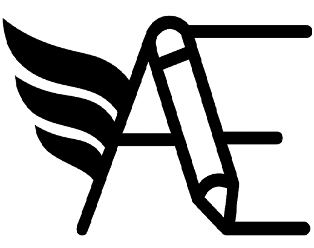

# Avro Editor



A static site that to visualize and edit avro schemas (.avsc).
A working and freely usable version ca be found at [https://onereallylongname.github.io/tools/avro/avro-editor.html](https://onereallylongname.github.io/tools/avro/avro-editor.html).
Now with a TUI version at [avedit](https://github.com/onereallylongname/avedit/tree/main).

It renders the avro fields as a tree with collapsible rows and details page.
The rows allow for deletion, copy, adding new and moving, fields.
The details pane enables editing the field attributes and type.

It can be deploy from pretty much anywhere as it is just static html, js ans css with no external dependencies (other than a browser)..

 ## Usability 

It has some predefined themes to pick from (top right section box).
It has keyboard shortcuts (vim compatible).
To learn more open the help menu (top right "?" button).

## Architecture & Inner Workings

### Data Pipeline
1. **Input Phase**: JSON schema accepted via file upload or textarea → `loadSchemaFromText()` parses and validates
2. **Projection Phase**: `buildProjection()` recursively traverses schema and creates a tree of internal nodes
   - Each node represents a schema element (record, field, primitive, union, etc.)
   - Nodes stored in a Map with unique IDs for efficient lookups
   - Each node has `attributes.native` (raw Avro JSON) and `attributes.custom` (internal metadata)
3. **Render Phase**: `renderSchemaTree()` converts projection nodes to DOM elements
   - Generates a collapsible tree with keyboard navigation (vim-style)
   - Detail panel shows editable node properties based on kind
   - Search, filters, and undo/redo managed separately
4. **Export Phase**: `generateAvroFromProjection()` reconstructs valid Avro schema from projection
   - Recursively emits each node type back to JSON format
   - Logical types and custom attributes preserved during round-trip

### Key Components

- **projection.js**: Core projection builder and Avro generator (parsing and emission)
- **render.js**: DOM rendering, keyboard navigation, detail panel, search
- **actions.js**: Mutation commands (add, delete, move, edit attributes)
- **utils.js**: Type templates, normalization, helper functions, validation rules
- **io.js**: File/JSON input, export to file/clipboard
- **avro.js**: Main lifecycle (init, mutations, undo/redo refresh)
- **undo.js**: Command history and undo/redo engine

### Projection Node Structure
```
{
  id: "n1",                    // unique internal ID
  kind: "field",               // node type
  parentId: "n0",              // parent node ID
  children: ["n2"],            // child node IDs
  path: ["fields", 0],         // breadcrumb to this node's location in schema
  attributes: {
    native: { name: "id", type: "int" },  // raw Avro properties
    custom: { __id: "uuid" }              // internal tracking
  }
}
```

### Type Normalization
Avro schema types come in several forms:
- **Primitive string**: `"string"`, `"int"`, `"null"`
- **Primitive object**: `{type: "int"}`, `{type: "int", logicalType: "date"}`
- **Complex**: `{type: "record", name: "Person", fields: [...]}`
- **Union**: `["null", "string"]` or `[{type: "int"}, "string"]`

The `normalizeType()` function standardizes all forms so downstream code can work uniformly.

## Disclaimer

1. This is a hobby project. This something I've wanted to have and could not find.
2. This was rewrite of a previous attempt an was (shamefully) mostly vibe coded. **Use at you own risk**.
